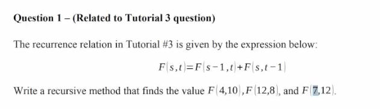
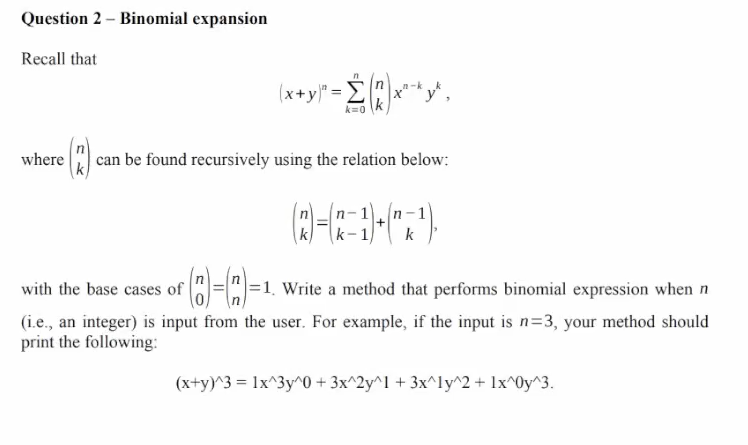
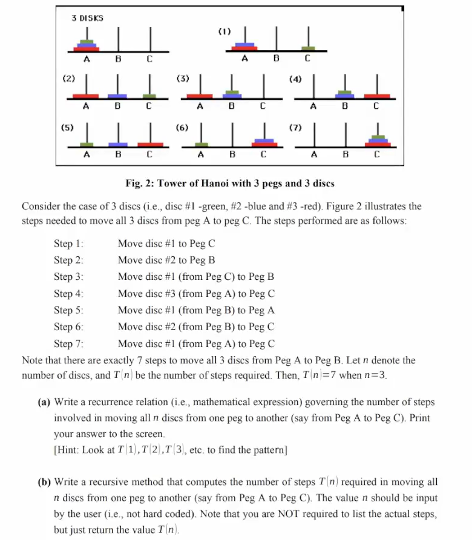

## WIA1002/WIB1002 Data Structure
### Tutorial 10:  Recursion (Applications)

#### Question 1
<p align="center">

</p>

##### Tips:
<p align="center">

</p>


```plaintext
public class Questionl {

    public static int F(int s, int t){
        if (t == 1)
            return s;
        else if (s == 1)
            return 1;
        else{
            int partl = F(s-1, t);
            int part2 = F(s, t-1);
            return partl + part2;
        }
    }

    public static void main(String[] args) {
          System.out.println(("F("+4+", "+10+") = " + F(4,10)));
          System.out.println(("F("+12+", "+8+") = " + F(12,8)));
          System.out.println(("F("+7+", "+12+") = " + F(7,12)));
    }
}

```

#### Question 2
<p align="center">

</p>

```plaintext
import java.util.Scanner;

public class Question2 {
    public static int binomial(int n, int k){
        if (k == n || k == 0){
            return 1;
        }else{
            int partl = binomial( n-1, k-1);
            int part2 = binomial( n-1, k);
            return partl + part2;
        }
    }


public static void main(String[] args) {
    Scanner input = new Scanner(System.in);
    System.out.print("Enter the degree of your binomial expression: ");
    int intInput = input.nextInt();

    System.out.print("(x+y)^" + intInput + "=");
    for (int k = 0; k <= intInput; k++) {
        System.out.print(binomial(intInput,k) + "x^"+(intInput-k)+"y^"+k);
        if (k != intInput)
            System.out.print(" + ");
    }
    System.out.println();
}
}
```


#### Question 3
<p align="center">

</p>

##### 3a
```plaintext
public static int TOH(int n){
        if(n==1) return 1;
        else return 2*TOH(n-1)+1;
    }
    
    public static void main(String[] args) {
        System.out.println("Recurrence relation: 2T(n+1)+1");
        System.out.print("How many slabs? (what is your n) ");
        Scanner input = new Scanner(System.in);
        int inputtedInt = input.nextInt();
        
        int finalResult = TOH(inputtedInt);
        System.out.println("Number of steps to complete the tower of Hanoi: "+finalResult);
    }
```
