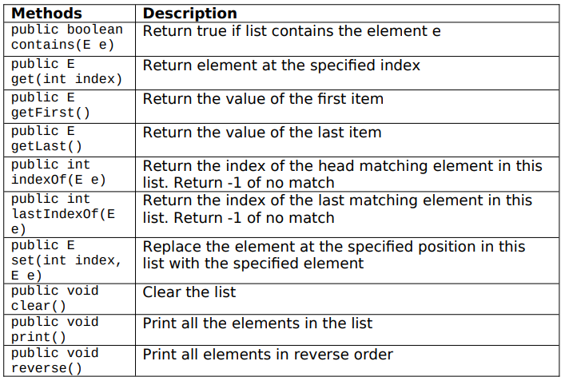

# Lab 4: Linked List

#### Cr: OOI RUI ZHE 23004947

### Question 1
#### 1) Write the generic Node class consisting of two components of a node (i.e.: element, next), with a default construct and a constructor that accepts an item assigned to the initially declared element variable.
```plaintext
public class Node<T> {
    T element;
    Node<T> next;

    public Node() {
        this.element= null;
        this.next = next;
    }

    public Node(T element, Node<T> next) {
        this.element = element;
        this.next = next;
    }

    public T getElement() {
        return element;
    }

    public Node<T> getNext() {
        return next;
    }

    public void setElement(T element) {
        this.element = element;
    }

    public void setNext(Node<T> next) {
        this.next = next;
    }
}
```

#### 2) Write a class called MyLinkedList. The class should have the following :
##### a. Default constructor
##### b. Nodes for head and tail
```plaintext
public class MyLinkedList <E> {
    private Node<E> head;
    private Node<E> tail;
    private int size = 0;

    public MyLinkedList() {
        head=null;
        tail=null;
    }
}
```

#### 3) Implement the following methods from tutorial in this class:
##### a. public void addFirst(E e)
```plaintext
    public void addFirst(E e){
        Node<E> newNode = new Node<E>(e);
        newNode.next = head;
        head = newNode;
        if(tail==null)
            tail=head;
        size++;
    }
```
##### b. public void addLast(E e)
```plaintext
public void addLast(E e){
    if(tail == null)
        head = tail = new Node<>(e);
    else{
        tail.next = new Node<>(e);
        tail = tail.next;
    }
    size++;
}
```
##### c. public void add(int index, E e)
```plaintext
    public void add(int index, E e){
        if(index ==0) addFirst(e);
        else if (index>= size) addLast(e);
        else{
            Node<E> current = head;
            for(int i=1;i<index;i++){
                current = current.next;
            }
            Node<E> temp = current.next;
            current.next= new Node<>(e);
            (current.next).next = temp;
            size++;
        }
    }
```
##### d. public E removeFirst()
```plaintext
public E removeFirst(){
        if(size == 0 ) return null;
        else{
            Node<E> temp = head;
            head = head.next;
            size--;
            if (head == null) tail = null;
            return temp.element;
        }
    }
```


##### e. public E removeLast()
```plaintext
public E removeLast(){
        if(size == 0) return null;
        else if (size == 1){
            Node<E> temp = head;
            head = tail = null;
            size = 0;
            return temp.element;
        }
        else{
            Node<E> current = head;
            for(int i=0;i<size-2;i++){
                current = current.next;
            }
            Node<E> temp = tail;
            tail = current;
            tail.next = null;
            size--;
            return temp.element;
        }
    }
```
##### f. public E remove(int index)
```plaintext
public E remove(int index){
        if(index<0 || index>= size)return null;
        else if(index == 0) return removeFirst();
        else if(index == size-1) return removeLast();
        else{
            Node<E> previous = head;
            for(int i=1;i<index;i++){
                previous = previous.next;
            }
            Node<E> current = previous.next;
            previous.next = current.next;
            size--;
            return current.element;
        }
    }
```

#### 4) Expand the MyLinkedList by implementing the following methods:
<p align="center">

</p>

public boolean contains(E e) {
        return this.indexOf(e) >= 0;
    }
    
    public E get(int index) {
        Node<E> current = head;
        if(index <0 || index>=size) return null;
        for(int i=0;i<index;i++) current = current.next;
        return current.element;
    }
    
    public E getFirst(){
        return this.head.element;
    }
    
    public E getLast(){
        return this.tail.element;
    }
    
    public int indexOf(E e){
        Node<E> current = head;
        int index = 0;
        
        while(current!= null){
            if(current.element == e){
                return index;
            }else{
                current = current.next;
                index++;
            }
        }
        return -1;
    }
    
    public int lastIndexOf(E e){
        int index = 0;
        int lastIndex = -1;
        Node<E> current = head;
        while(current != null){
            if(current.element.equals(e)){
                lastIndex = index;
            }
            current = current.next;
            index++;
        }
        return lastIndex;
    }
    
    public E set(int index, E e){
        Node<E> current = head;
        for(int i=0;i<index;i++){
            current = current.next;
        }
        E oldElement = current.element;
        current.element = e;
        return oldElement;
    }
    
    public void clear(){
        head=null;
        tail = null;
        size = 0;
    }
    
    public void print(){
        Node<E> current = head;
        while(current !=null){
            System.out.println(current.element+" ");
            current = current.next;
        }
        System.out.println();
    }
    
    public void reverse(){
        for(int i=size-1;i>=0;i--){
            System.out.print(get(i)+" ");
        }
    }


#### 5) Write a test program called TestLinkedList that creates a list from MyLinkedList class. Using the methods in (3) and (4), do the following:
##### a. Append the following : a, b, c, d, e
##### b. Print all the elements in the list.
##### c. Reverse all the elements in the list.
##### d. Retrieve the number of elements in the list.
##### e. Retrieve the first and last value.
##### f. Delete the third value.
##### g. Retrieve the index location for the second and third value.
##### h. Checks if the list has the value ‘c’.
##### i. Replace the items individually with the following: j,a,v,a
```plaintext
public class TestLinkedList {
    public static void main(String[] args) {
        MyLinkedList<Character> list= new MyLinkedList<>(); 
        
        //a) Append the following : a, b, c, d, e
        list.addFirst('a');
        list.add(1, 'b');
        list.add(2, 'c');
        list.add(3, 'd');
        list.add(4, 'e');
        
        //b) Print all the elements in the list
        System.out.println("Elements in the list:");
        list.print();
        
        //c) Reverse all the elements in the list
        System.out.println("\nElements in the list(reversed order)");
        list.reverse();
        System.out.println("");
        
        //d) Retrieve the number of elements in the list
        System.out.println("\nNumber of elements in the list: ");
        list.indexOf(list.getLast());
        
        //e) Retrieve the first and last value
        System.out.println("First value: "+list.getFirst());
        System.out.println("Last value: "+list.getLast());
        
        //f) Delete the third value
        System.out.println("");
        System.out.println("Elements removed: "+list.remove(2));
        System.out.println("Elements left in the list:");
        list.print();
        
        //g) Retrieve the index location for the second and third value
        System.out.println("");
        System.out.printf("Index Location for b: %s\n", list.indexOf('b'));
        System.out.printf("Index Location for c: %s\n", list.indexOf('d'));
        
        //h) Check if the list has the value of 'c'
        System.out.println("\nValue of 'c' is inside the list: "+ list.contains('c'));
        
        //i) Replace the items individually with the following: j,a,v,a
        list.set(0, 'j');
        list.set(1, 'a');
        list.set(2, 'v');
        list.set(3, 'a');
        System.out.println("\nElements in the list after replacement: ");
        list.print();
    }
}
```

### Question 2
##### A method called getMiddleValue() returns the value of the middle element of a linked list. The method signature is given as follows :
##### public E getMiddleValue()
##### Write the codes for the getMiddleValue().
```plaintext
    public E getMiddleValue(){
        Node<E> current = head;
        for (int i = 0; i < (size + 1) / 2; i++) {
            current = current.next;
        }
        return current.element;
    }
```

