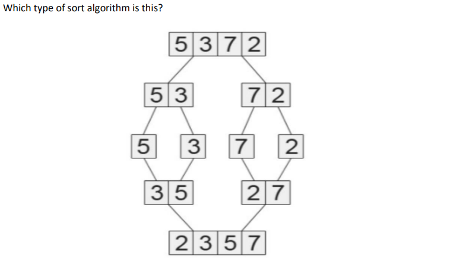
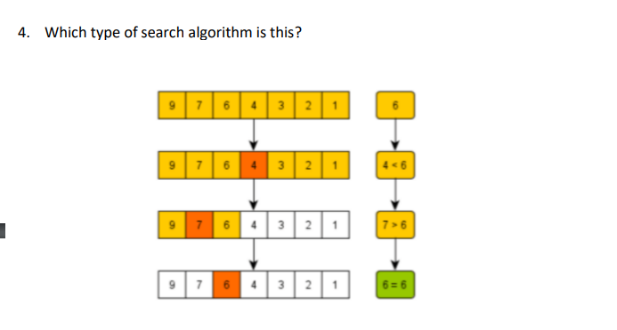
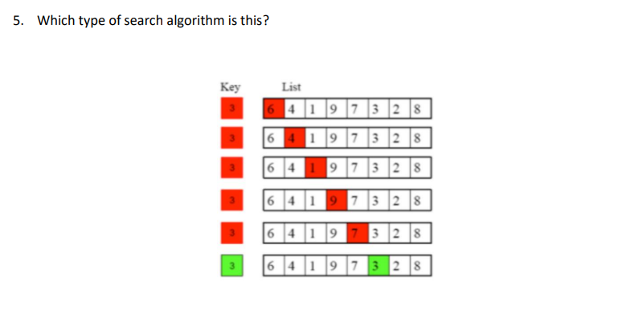

## WIA1002/WIB1002 Data Structure
### Tutorial 11:   Sorting and searching

#### Question 1:
#### Compare between linear search and binary search algorithms by searching for the numbers 45 and 54 in the following list :
##### 3 8 12 34 54 85 61 110

```plaintext
Linear search:
- Search sequentially from index 0 -> index n, stop when you found the element.
i) 45: 0,1,2,3,4,5,6,7 = Not in the list = 8 times checking
ii) 54: 0,1,2,3,4 = Found at index 4 = 4 times checking

Binary search:
- Sort: 3  8  12  34  54  61  85  110

i) Searching for 45: 
- Get the middle index = 3-> value of = 34
- Check, 45>34
- Get middle index = 5 -> value of =  61
- Check, 45<65
- is 45 =54? No
- So 45 is not in the list

ii) Searching for 54: 
- Get the middle index = 3-> value of = 34
- Check, 54>34
- Get middle index = 5 -> value of =  61
- Check, 54<65
- is 54=54? Yes
- Found

```

#### Question 2:
#### Describe the technique for each sort algorithm below. Given the following list:
##### 90  8  7  56  125  237  9  1  653

```plaintext
Show a trace of execution for:
a. Selection sort
b. Insertion sort
c. Bubble sort
d. Merge sort
```

```plaintext
Answer:
a. Selection sort:
90  8  7  56  125  237  9  1  653
i)  Identify the minimum =1
ii) Then lock the swap value:  `1`  8  7  56  125  237  9  90  653
iii) Next, starting the second index
iv) Find the next minimum and swap with the element at the 2nd index
v) Lock the swap value :  `1`  `7`  8  56  125  237  9  90  653
vi) Repeat the steps above until all the elements are correctly sorted.

Sorted:  1  7  8  9  56  90  124  237  653

```


```plaintext
Answer
b. Insertion sort

Initial: 90  8  7  56  125  237  9  1  653

i) Assume the first value, is sorted
ii) Go to second element, compare with the sorted list (sorted list:90)
8  90  7  56  125  237  9  1  653
iii) Go to third element, compare with the sorted list(sorted list:8  90)
7  8  90  56  125  237  9  1  653
iv) Repeat the steps above until all the elements are correctly sorted.

Sorted:  1  7  8  9  56  90  124  237  653
```


```plaintext
c. Bubble sort

Initial: 90  8  7  56  125  237  9  1  653

1st pass:
8  90  7  56  125  237  9  1  653
8  7  90  56  125  237  9  1  653
8  7  56  90  125  237  9  1  653
8  7  56  90  125  9  237  1  653
8  7  56  90  125  9  1  237  653


2nd pass:
7  8  56  90  125  9  1  237  653
7  8  56  90  9  125  1  237  653
7  8  56  90  9  1  125  237  653


3rd pass:
7  8  56  9  90  1  125  237  653
7  8  56  9  1  90  125  237  653


4th pass:
7  8  56  9  1  90  125  237  653
7  8  9  56  1  90  125  237  653
7  8  9  1  56  90  125  237  653

5th pass:
7  8  9  1  56  90  125  237  653
7  8  1  9  56  90  125  237  653

6th pass:
7  8  1  9  56  90  125  237  653
7  1  8  9  56  90  125  237  653

7th pass:
7  1  8  9  56  90  125  237  653
1  7  8  9  56  90  125  237  653


Explanation:

i) First pass:
- Compare adjacent elements.
- Swap if the first is greater than the second.
- Repeat until the end of the array.

ii) Next pass:
- Repeat the comparison and swapping from the beginning.
- Exclude the last sorted elements.

iii) Continue:
- Repeat until the array is sorted.
```

```plaintext
d. Merge sort

Initial: 90  8  7  56  125  237  9  1  653

i) Split into two:
   90  8  7  56 | 125 237 9 1 653
ii) Split into two again:
   90  8 | 7  56 |  124  237  | 9   1  653|
iii) Split into two again:
   90 | 8 | 7 | 56 |  124 | 237  | 9  | 1  653|

iv) Split for the last time for the unsplitted
   90 | 8 | 7 | 56 |  124 | 237  | 9  | 1 | 653|
v) Merge them back with sorted order
   90 | 8 | 7 | 56 |  124 | 237  | 9  | 1  653|
   8  90 | 7  56 |  124  237  |  1   9  653|
   7  8  56  90 |  1  9  124  237  653
   1  7  8  9  56  90  124  237  653
```


#### Question 3
<p align="center">

</p>

```plaintext
Merge sort
```

#### Question 4
<p align="center">

</p>

```plaintext
binary search
```

#### Question 5
<p align="center">

</p>

```plaintext
linear search
```
