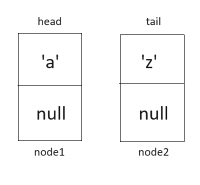

## WIA1002/WIB1002 Data Structure
### Tutorial 4: Linked List

#### Question 1
##### (a)Assume that a node class called Node<E> exist. Create two nodes called node1 and node2. Node1 contains alphabet ‘a’ and node2 contains alphabet ‘z’. Also, create 2 references, head and tail. Let head points to node 1 and tail points to node 2.
```plaintext
Node<Character> node1 = new Node<>('a');
Node<Character> node2 = new Node<>('z'):
Node<Character> head = node1;
Node<Character> tail = node2;
```

##### (b) Draw the nodes from (a).
<p align="center">

</p>


