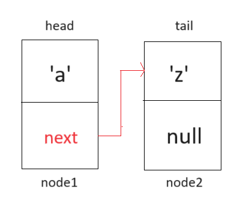
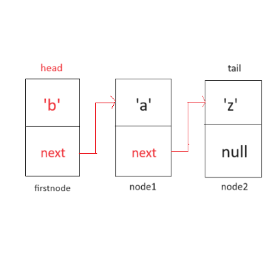

## WIA1002/WIB1002 Data Structure
### Tutorial 4: Linked List

#### Question 1
##### (a)Assume that a node class called Node<E> exist. Create two nodes called node1 and node2. Node1 contains alphabet ‘a’ and node2 contains alphabet ‘z’. Also, create 2 references, head and tail. Let head points to node 1 and tail points to node 2.
```plaintext
Node<Character> node1 = new Node<>('a');
Node<Character> node2 = new Node<>('z'):
Node<Character> head = node1;
Node<Character> tail = node2;
```

##### (b) Draw the nodes from (a).
<p align="center">

</p>


##### (c)  Write a statement/code for node1 accessing the node2. Modify 1(b) to show this
```plaintext
head.next = tail;
```
<p align="center">

</p>

##### (d) Create a new node, firstNode. Add this new node at the first location of all existing nodes. Draw these nodes. 
```plaintext
Sample:
Node<Character> firstNode = new Node<>('b');
firstNode.next = head;
head = firstNode;
```
<p align="center">

</p>

##### (e) If we have no information about the status of a linked-list, what are the conditions we need to consider to perform the operation in (d)?
```plaintext
* Add node
* Is the new node, the only node in the list?
* If there is already many nodes in the list
```

##### (f) Write a list of operations/steps/pseudocode needed to add the firstNode to the first location.
```plaintext
* Condition 1:
  -> If tail == null, then tail == head
       - This refers to the same node (both head and tail)

* Condition 2:
  -> Create a new node object
  -> Assign the new node's(firstNode) next reference to the current first node (current head)
  -> Assign the new node(firstNode) as the head
```

##### (g) Write codes to assign the firstNode to the first location. 
```plaintext
public void addFirst(Character e){
  Node<Character> firstNode = new Node<Character>(e);
  firstNode.next = head;
  head = firstNode;
  size+=1;
  if(tail == null){
    tail = head;
  }
}
```

##### (h) Repeat (d) – (f), for the following operations :
##### (h) (i)addLast() – value of element, c
```plaintext
public void addLast(Character c){
  Node<Character> lastNode = new Node<Character>(c);
    if (tail == null) {
        head = lastNode;
        tail = lastNode;
    } else {
        tail.next = lastNode;
        tail = lastNode;
    }
    size++; 
}

//in main method call:
//list.addLast('c');

```
##### (h) (ii)add(int index, E e) – value of element, d
```plaintext
public void add(int index, E e) {
    if (index == 0) {
        addFirst(e);
    } else if (index >= size) {
        addLast(e);
    } else {
        Node<E> current = head; //set current as head
        for (int i = 1; i < index; i++) {  //iterate before the adding node
            current = current.next;
        }
        Node<E> temp = current.next; 
        current.next = new Node<>(e); 
        current.next.next = temp; //
        size++;
    }
}

// Call add method to add element 'd' at index 3
//list.add(3, 'd');
```

##### (h) (iii) removeFirst() 
```plaintext


```

##### (h)(iv) removeLast()
```plaintext


```

##### (h) (v) remove(int index) – remove at index 1
```plaintext


```


