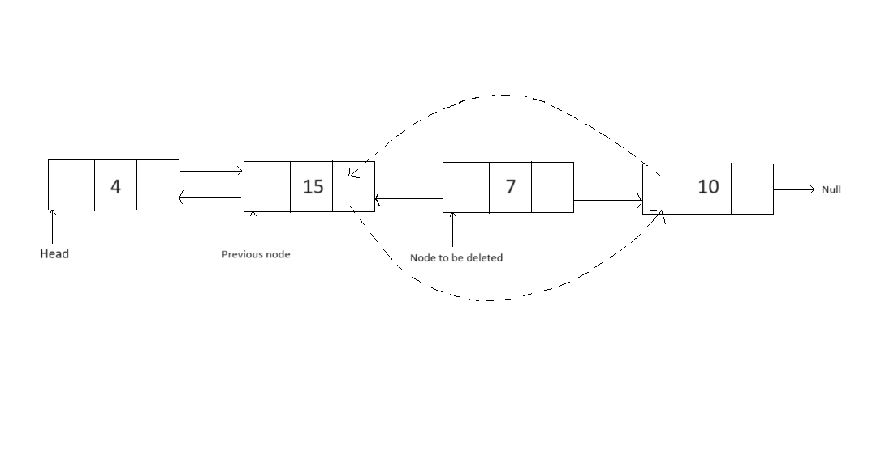
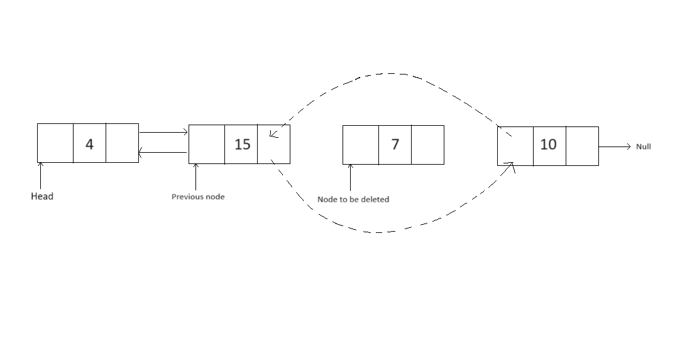
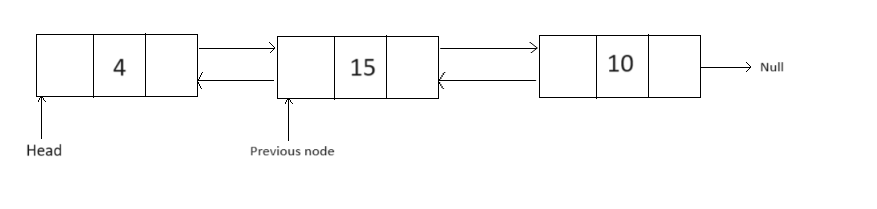

## WIA1002/WIB1002 Data Structure
### Tutorial 5: Linked List & Doubly Linked List

#### Question 1
```plaintext
1   public E xyz(int index,E e)
2   {
3     Node<E> current=head;
4     Node<E> temp;
5       if(index<0) return null;
6       else if(index>=size-1) {
7           this.addLast(e);
8           return null;
9       }
10      else if(index==0) {
11         temp=head;
12         head.element=e;
13         return temp.element;
14      }else{
15         for (int i = 1; i < index; i++) {
16             current=current.next;
17         }
18         temp=current.next;
19         current.next.element=e;
20         return temp.element;
21      }
```

##### Given method xyz with 2 arguments:
##### a) Based on the above source code, explain what the lines of code do from line 10 – 21.

Line 10 to Line 21 adds the element `e` of generic type `E` into the linked list at the index of `index`. Line 10 to 14 adds e to the first index of the linked list, whereas line 14 to line 21 adds e to any index position in the linked list.


##### b) What is the main purpose of the method xyz()?

The main purpose of `xyz()` is to insert a node of element `e` into the specific `index` of the linked list.

##### c) Obviously, there are some bugs in the source code. Debug the code and make it concise and simpler. 
```plaintext
public void xyz(int index,E e){
     if(index<0 ) throw new IndexOutOfBoundException();
     if(index >= size ) this.addLast(e);
     Node<E> current=head;
     Node<E> temp = new Node<>(e);

       if(index==0) { //same with addFirst(e);
          temp.next=head;
          head=temp;
       }else{
          for (int i = 1; i < index; i++) {
              current=current.next;
          }
          temp.next=current.next;
          current.next=temp;
       }
       size++;
}
```

#### Question 2
```plaintext
1 else{
2      Node<E> temp = head;
3      for(int i=0; i<index; i++){
4           temp = temp.next;
5      }
6      element = temp.element;
7      temp.next.prev = temp.prev;
8      temp.prev.next = temp.next;
9      temp.next = null;
10     temp.prev = null;
11     size --;
12 }
```

##### Based on the source code above, assume the index given is 3
##### a) Explain what the lines of code do from line 2-11.
```plaintext
At line 2, it starts by setting a temporary node `temp` to the `head` of the list.
At line 3-5, it then iterates through the list, moving `temp` to the node at specified index.
At line 6, it retrieves the element stored in the node at that index, so that will be returned after that.
At line 7-10,  we link the `previous` node and `next` node of the node of index `index` together and then disconnect the node at index `index` to both nodes.
Finally, it sets the references of `temp` to null to sever any connections and decrements the size of the list.
```

##### b) Draw the nodes for lines 7 - 10 
<p align="center">

</p>

<p align="center">

</p>

<p align="center">

</p>
