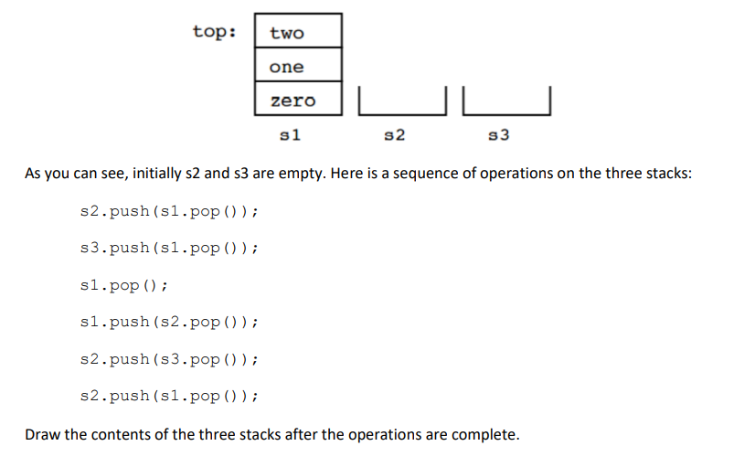
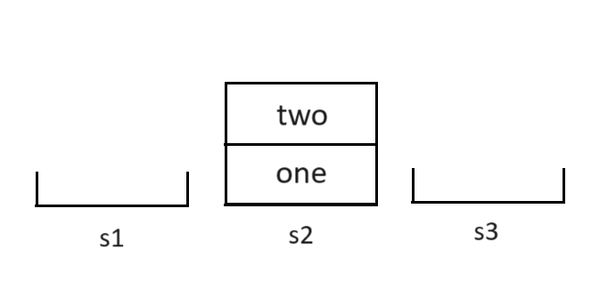

## WIA1002/WIB1002 Data Structure
### Tutorial 6: Stack

#### Question 1
##### The stack method that returns an element from the stack without removing it is ____________.
##### a. pop
##### b. push
##### c. peek
##### d. spy
```plaintext
 c. peek //access the value on top
```
#### Question 2
##### We have three stacks, s1, s2 and s3, that can contain data of type String. Here are their initial contents:
<p align="center">

</p>

<p align="center">

</p>

#### Question 3
##### Over time, the elements 1, 2, and 3 are pushed onto a stack in that order. For each of the following, indicate (yes or no) whether the sequence could be created by popping operations. If yes, list the sequence of push() and pop() operations that produces the sequence.

##### (a) 1-2-3 (b) 2-3-1 (c) 3-2-1 (d) 1-3-2

##### (a) 1-2-3
```plaintext
Yes

push(1);
pop(1);
push(2);
pop(2);
push(3);
pop(3);
```

##### (b) 2-3-1
```plaintext
Yes

push(1);
push(2);
pop(2);
push(3);
pop(3);
pop(1);
```

##### (c) 3-2-1
```plaintext
Yes

push(1);
push(2);
push(3);
pop(3);
pop(2);
pop(1);
```


##### (d) 1-3-2
```plaintext
Yes

push(1);
pop(1);
push(2);
push(3);
pop(2);
pop(1);
```

#### Question 4:
##### Convert the following infix expressions to postfix:

##### a) a + b * c
```plaintext
a b c * +
```

##### b) a * b – c/d
```plaintext
a b * c d / -
```

##### c) a + (b*c + d)/e
```plaintext
a b c * d + e / +
```

#### Question 5:
##### Write the following expressions in infix form:

##### a) a b + c *
```plaintext
(a+b)* c
```

##### b) a b c + *
```plaintext
a * (b + c)
```

#### Question 6:
##### Which of the following is an application of stack?
##### A. finding factorial
##### B. tower of Hanoi
##### C. infix to postfix
##### D. all of the above

```plaintext
D. all of the above
```

