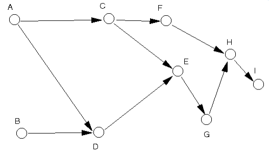

## WIA1002/WIB1002 Data Structure
### Tutorial 9:  Graph

#### Question 1
##### Write an adjacency matrix and an adjacency list for the following graph
<p align="center">

</p>

<p align="center">

</p>

```plaintext
     A  B  C  D  E  F  G  H  I  
  ┌─                           ─┐
A │  0  0  1  1  0  0  0  0  0  │
B │  0  0  0  1  0  0  0  0  0  │
C │  0  0  0  0  1  1  0  0  0  │
D │  0  0  0  0  1  0  0  0  0  │
E │  0  0  0  0  0  0  1  0  0  │
F │  0  0  0  0  0  0  0  1  0  │
G │  0  0  0  0  0  0  0  1  0  │
H │  0  0  0  0  0  0  0  0  1  │
I │  0  0  0  0  0  0  0  0  0  │
  └─                           ─┘
```

#### Question 2
##### 2. Represent the graph in question 1 using a 2 dimensional array. You use the adjacency matrix or the adjacency list for this purpose?
```plaintext
int[][] adjacencymatrix = {{0,0,1,1,0,0,0,0,0},
                           {0,0,0,1,0,0,0,0,0},
                           {0,0,0,0,0,1,1,0,0},
                           {0,0,0,0,0,1,0,0,0},
                           {0,0,0,0,0,0,1,0,0},
                           {0,0,0,0,0,0,0,1,0},
                           {0,0,0,0,0,0,0,1,0},
                           {0,0,0,0,0,0,0,0,1},
                           {0,0,0,0,0,0,0,0,0}
}
```
